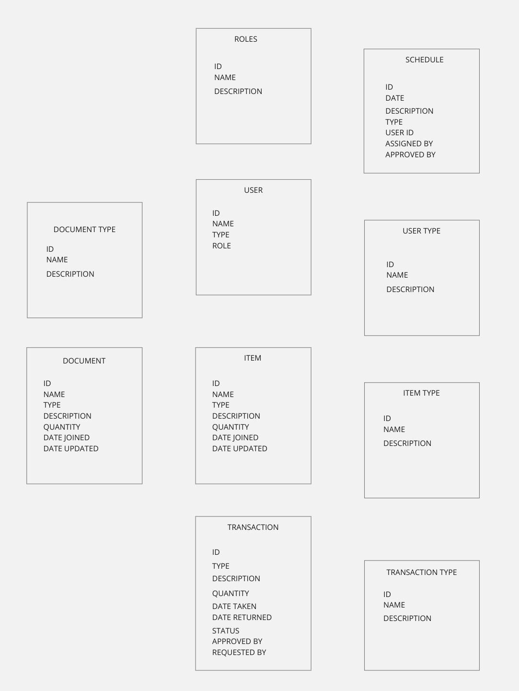

I want to build an inventory management system with also to store documents and other items. where users can login and add items to the inventory, and also add documents to the inventory. 

Things to consider:
- for the relational mapping. I want to use this image 
- I want to use uv for installing the dependencies
- I want to use a well defined folder structure
- I want to use postgres for the database
- I want to use fastapi for the api
